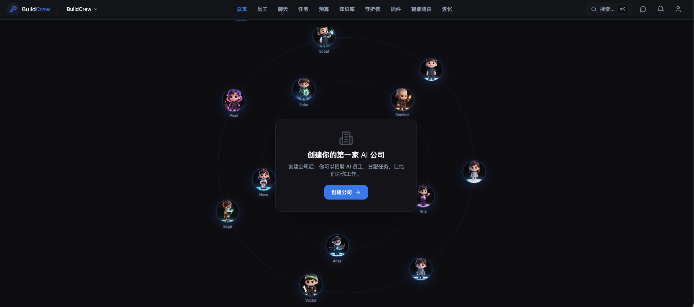

# BuildCrew

[English](README.md) | [简体中文](README_zh-CN.md) | [日本語](README_ja.md)

**AI チームを構築し、AI 会社を運営する。**

BuildCrew は、複数の AI エージェントを仮想企業として編成するオープンソースプラットフォームです。AI CEO（Aria）と対話するだけで、チーム編成、計画策定、タスク割り当て、協働実行を自動で行います。

> AI がスタッフなら、BuildCrew は彼らが働く会社です。



---

## ワークフロー

```
会社を作成  →  Aria と対話  →  計画を起動  →  実行  →  ダッシュボード
```

1. **会社を作成** — 名前、ミッション、業界テンプレートを入力
2. **Aria と対話** — ソクラテス式の質問で、一つずつ分析と提案を交えて聞いてくれます
3. **起動** — Aria が計画、チーム構成、コスト見積もりをまとめます。あなたが確認
4. **実行** — ワンクリックで Aria がエージェントを採用、目標を作成、タスクを割り当て
5. **ダッシュボード** — AI 会社の運営状況を確認：組織図、タスク進捗、目標達成度


## 機能

- **Aria（AI CEO）** — ソクラテス式の自律ワークフロー。思考、計画、実行を自動で行います
- **マルチエージェントチーム** — エンジニア、デザイナー、マーケター、アナリストなど12の専門職
- **組織図** — 部門、レポートライン、階層管理
- **タスク管理** — 目標、タスク、割り当て、進捗追跡
- **スマートルーター** — スキル、コスト、空き状況に基づく最適なタスク割り当て
- **ガーディアン** — セキュリティ監視、異常検知、自動アラート
- **レビューパイプライン** — 3段階レビュー：自動チェック → ピアレビュー → 人間の承認
- **ナレッジハブ** — セマンティック検索、自動抽出、共有コンテキスト
- **マルチモデル** — Claude、GPT、DeepSeek、GLM、Kimi など対応
- **国際化** — English、简体中文、日本語
- **デジタルヒューマン** — 12種のQ版3Dキャラクターアニメーション

## クイックスタート

### 前提条件

- Node.js 20+
- pnpm 9.15+
- PostgreSQL 16
- Redis

### インストールと実行

```bash
git clone https://github.com/Linjian5/buildcrew.git
cd buildcrew
pnpm install

# データベース
createdb buildcrew
cp apps/server/.env.example apps/server/.env
# .env を編集 — AI プロバイダーの API キーを入力

pnpm db:push
pnpm db:seed

# 起動
pnpm dev
```

ブラウザで [http://localhost:5173](http://localhost:5173) を開く

### 初回利用

1. アカウント登録
2. 会社を作成 — 業界テンプレートを選択
3. Aria と対話 — 目標を伝える
4. **起動** をクリック — 計画を確認
5. **実行** をクリック — AI チームが稼働開始

### AI プロバイダー設定

`apps/server/.env` で AI プロバイダーを設定：

```env
PLATFORM_AI_KEY=あなたのAPIキー
PLATFORM_AI_PROVIDER=openai
PLATFORM_AI_MODEL=gpt-4o
PLATFORM_AI_ENDPOINT=https://api.openai.com/v1
```

| プロバイダー | モデル |
|-------------|--------|
| OpenAI | gpt-4o, gpt-4o-mini |
| Anthropic | claude-sonnet-4-6, claude-haiku-4-5 |
| DeepSeek | deepseek-chat, deepseek-coder |
| 智谱 AI (GLM) | glm-4-plus, glm-4-flash |
| Moonshot (Kimi) | moonshot-v1-8k, moonshot-v1-128k |
| カスタム | OpenAI 互換エンドポイント |

## 技術スタック

| レイヤー | 技術 |
|---------|------|
| フロントエンド | React 19, TypeScript, Vite, TailwindCSS, shadcn/ui |
| バックエンド | Node.js, Express, TypeScript, socket.io |
| データベース | PostgreSQL 16, Drizzle ORM, pgvector |
| キャッシュ | Redis, BullMQ |
| AI | OpenAI 互換 + Anthropic ネイティブ形式 |
| テスト | Vitest, Playwright |

## プロジェクト構造

```
buildcrew/
├── apps/
│   ├── web/              — React フロントエンド
│   └── server/           — Node.js API サーバー
├── packages/
│   ├── shared/           — 共有型と定数
│   └── db/               — データベーススキーマ（Drizzle ORM）
├── tests/                — ユニット / 統合 / E2E テスト
└── docs/                 — ドキュメント
```

## コマンド

```bash
pnpm dev              # 開発サーバー起動
pnpm build            # プロダクションビルド
pnpm typecheck        # TypeScript 型チェック
pnpm lint             # ESLint
pnpm test             # テスト実行
pnpm db:push          # スキーマ同期
pnpm db:seed          # デモデータ投入
```

## ロードマップ

### フェーズ 1 — 基盤（完了）

- [x] コアエンジン — 会社、エージェント、タスク CRUD + WebSocket リアルタイム同期
- [x] Aria（AI CEO）— ソクラテス式対話 + 自律計画 + 2段階実行
- [x] マルチモデル AI — Claude、GPT、DeepSeek、GLM、Kimi + OpenAI 互換エンドポイント
- [x] スマートルーター — スキル、コスト、空き状況に基づく5つのルーティング戦略
- [x] ガーディアン — 4段階アラート + 異常自動対応
- [x] レビューパイプライン — 3段階：自動チェック → ピアレビュー → 人間の承認
- [x] ナレッジハブ — セマンティック検索（pgvector）、自動抽出、コンテキスト注入
- [x] 進化エンジン — パフォーマンススコア、能力プロファイル、A/Bテスト
- [x] デジタルヒューマン — 12種のQ版3Dアニメーション（各5状態）
- [x] 国際化 — English、简体中文、日本語
- [x] 認証 — JWT ログイン/登録、セッション維持

### フェーズ 2 — 安定化（進行中）

- [ ] ウォレット＆課金 — プリペイドクレジット、トークンベースのコスト追跡
- [ ] 継続運用 — イベント駆動エージェントワークループ
- [ ] 通知システム — リアルタイムアラート、未読バッジ
- [ ] 自動テスト — Playwright E2E テスト + CI/CD パイプライン
- [ ] ロール認知システム — 8モジュールプラットフォーム認知 + 職種別専門知識

### フェーズ 3 — 成長

- [ ] プラグイン SDK — カスタムツールと統合
- [ ] エージェントマーケットプレイス — コミュニティ製エージェントの共有
- [ ] チームテンプレート — SaaS、EC、コンテンツ制作などのプリセット
- [ ] 高度な分析 — コスト内訳、生産性指標、トレンドチャート
- [ ] クラウドデプロイ — Vercel + Railway へワンクリックデプロイ
- [ ] マルチカンパニーグループ — 複数 AI 会社の一元管理
- [ ] カスタムエージェントビルダー — 独自プロンプトとスキルで専用エージェント作成

### フェーズ 4 — スケール

- [ ] モバイルアプリ — iOS & Android
- [ ] API & SDK — 外部統合・自動化用パブリック API
- [ ] バーチャルオフィス — AI 会社の俯瞰ビュー、リアルタイム活動表示
- [ ] クロスカンパニーコラボレーション — 異なる会社のエージェント間協働
- [ ] セルフホスト — Docker / Kubernetes エンタープライズデプロイ
- [ ] ファインチューンモデル — 会社データとスタイルに特化した専用 AI モデル

## コントリビュート

コントリビュートを歓迎します！[CONTRIBUTING.md](CONTRIBUTING.md) をご覧ください。

英語・中国語・日本語での Issue と PR を歓迎します。

## ライセンス

[Apache-2.0](LICENSE)

---

[Claude Code](https://claude.ai/code) で構築。
