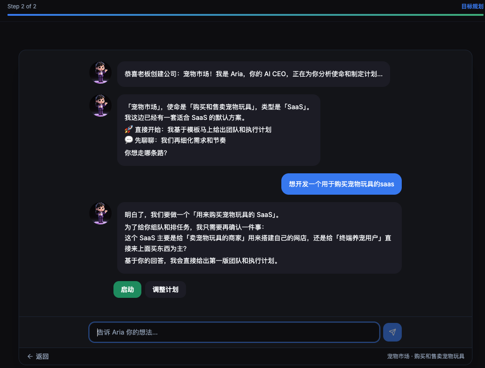

# BuildCrew

[English](README.md) | [简体中文](README_zh-CN.md) | [日本語](README_ja.md)

**构建你的 AI 团队，运行你的 AI 公司。**

BuildCrew 是一个开源的 AI 多智能体编排平台。通过和 AI CEO（Aria）对话，她会自动组建团队、制定计划、分配任务、协作执行。

> 如果 AI 是员工，BuildCrew 就是他们工作的公司。


---

## 工作流程

```
创建公司  →  和 Aria 对话  →  启动方案  →  立即执行  →  总览页
```

1. **创建公司** — 填写名称、使命，选择行业模板
2. **和 Aria 对话** — 她会逐个提问，带上自己的分析和建议
3. **启动** — Aria 汇总方案、团队配置、预估费用，你来审核
4. **立即执行** — 一键执行。Aria 招聘团队、创建目标、分配任务
5. **总览页** — 查看 AI 公司运转：组织架构、任务进度、目标达成



## 功能特性

- **Aria（AI CEO）** — 苏格拉底式自治工作流，自主思考、规划、执行
- **多智能体团队** — 12 个专业角色：工程师、设计师、营销、分析师等
- **组织架构** — 部门、汇报关系、层级管理
- **任务管理** — 目标、任务、分配、进度追踪
- **智能路由** — 根据技能、成本、可用性自动分配任务
- **安全卫士** — 安全监控、异常检测、自动告警
- **审查流水线** — 三阶段审查：自动检查 → 同行评审 → 人工批准
- **知识中心** — 语义搜索、自动提取、共享上下文
- **多模型支持** — Claude、GPT、DeepSeek、GLM、Kimi 等
- **国际化** — English、简体中文、日本語
- **数字人** — 12 个 Q 版 3D 角色动画

## 快速开始

### 前置条件

- Node.js 20+
- pnpm 9.15+
- PostgreSQL 16
- Redis

### 安装运行

```bash
git clone https://github.com/Linjian5/buildcrew.git
cd buildcrew
pnpm install

# 数据库
createdb buildcrew
cp apps/server/.env.example apps/server/.env
# 编辑 .env — 填入你的 AI 服务商 API Key

pnpm db:push
pnpm db:seed

# 启动
pnpm dev
```

打开 [http://localhost:5173](http://localhost:5173)

### 首次使用

1. 注册账号
2. 创建公司 — 选择行业模板
3. 和 Aria 对话 — 告诉她你要做什么
4. 点击 **启动** — 审核方案
5. 点击 **立即执行** — 看 AI 团队开始工作

### AI 服务配置

在 `apps/server/.env` 中配置 AI 服务商：

```env
PLATFORM_AI_KEY=你的API密钥
PLATFORM_AI_PROVIDER=openai
PLATFORM_AI_MODEL=gpt-4o
PLATFORM_AI_ENDPOINT=https://api.openai.com/v1
```

| 服务商 | 可用模型 |
|--------|---------|
| OpenAI | gpt-4o, gpt-4o-mini |
| Anthropic | claude-sonnet-4-6, claude-haiku-4-5 |
| DeepSeek | deepseek-chat, deepseek-coder |
| 智谱 AI | glm-4-plus, glm-4-flash |
| Moonshot（Kimi） | moonshot-v1-8k, moonshot-v1-128k |
| 自定义 | 任何 OpenAI 兼容端点 |

## 技术栈

| 层级 | 技术 |
|------|------|
| 前端 | React 19, TypeScript, Vite, TailwindCSS, shadcn/ui |
| 后端 | Node.js, Express, TypeScript, socket.io |
| 数据库 | PostgreSQL 16, Drizzle ORM, pgvector |
| 缓存 | Redis, BullMQ |
| AI | OpenAI 兼容格式 + Anthropic 原生格式 |
| 测试 | Vitest, Playwright |

## 项目结构

```
buildcrew/
├── apps/
│   ├── web/              — React 前端
│   └── server/           — Node.js API 服务
├── packages/
│   ├── shared/           — 共享类型和常量
│   └── db/               — 数据库 Schema（Drizzle ORM）
├── tests/                — 单元 / 集成 / E2E 测试
└── docs/                 — 文档
```

## 常用命令

```bash
pnpm dev              # 启动开发服务
pnpm build            # 生产构建
pnpm typecheck        # TypeScript 类型检查
pnpm lint             # ESLint 检查
pnpm test             # 运行测试
pnpm db:push          # 同步数据库
pnpm db:seed          # 填充演示数据
```

## 路线图

### 第一阶段 — 地基（已完成）

- [x] 核心引擎 — 公司、Agent、任务 CRUD + WebSocket 实时同步
- [x] Aria（AI CEO）— 苏格拉底式对话、自主规划、两步执行
- [x] 多模型 AI — Claude、GPT、DeepSeek、GLM、Kimi + 任意 OpenAI 兼容端点
- [x] 智能路由 — 5 种路由策略，基于技能、成本、可用性
- [x] 安全卫士 — 4 级告警 + 异常自动响应
- [x] 审查流水线 — 三阶段审查：自动检查 → 同行评审 → 人工批准
- [x] 知识中心 — 语义搜索（pgvector）、自动提取、上下文注入
- [x] 进化引擎 — 绩效评分、能力画像、A/B 测试
- [x] 数字人 — 12 个 Q 版 3D 角色动画（每个 5 种状态）
- [x] 国际化 — English、简体中文、日本語
- [x] 认证 — JWT 登录注册、会话保持

### 第二阶段 — 稳定（进行中）

- [ ] 钱包与计费 — 充值余额制、按 token 计费、Agent 预算管理
- [ ] 持续运营 — 事件驱动 Agent 工作循环（任务完成 → 下个任务 → 里程碑汇报）
- [ ] 通知系统 — 实时提醒、未读徽章、应用内通知中心
- [ ] 自动化测试 — Playwright E2E 测试 + CI/CD 流水线
- [ ] 角色认知体系 — 8 模块平台认知 + 角色专业层知识

### 第三阶段 — 增长

- [ ] 插件 SDK — 为 Agent 构建自定义工具和集成
- [ ] Agent 市场 — 分享和发现社区构建的 Agent 角色
- [ ] 团队模板 — 预设团队配置（SaaS、电商、内容创作等场景）
- [ ] 高级分析 — 成本明细、生产力指标、趋势图表
- [ ] 云端部署 — 一键部署到 Vercel + Railway
- [ ] 多公司集团 — 在一个面板管理多个 AI 公司
- [ ] 自定义 Agent — 用自定义 Prompt 和技能创建专属 Agent

### 第四阶段 — 规模化

- [ ] 移动端 App — iOS & Android 配套应用
- [ ] API & SDK — 公开 API，支持外部集成和自动化
- [ ] 虚拟办公室 — AI 公司俯视图，实时查看 Agent 活动
- [ ] 跨公司协作 — 不同公司的 Agent 协同工作
- [ ] 私有化部署 — Docker / Kubernetes 企业部署方案
- [ ] 专属模型 — 基于公司数据和风格微调的专属 AI 模型

## 贡献

欢迎贡献！请查看 [CONTRIBUTING.md](CONTRIBUTING.md) 了解指南。

欢迎提交中英文的 Issue 和 PR。

## 许可

[Apache-2.0](LICENSE)

---

使用 [Claude Code](https://claude.ai/code) 构建。
